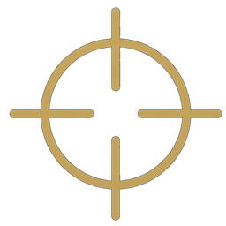
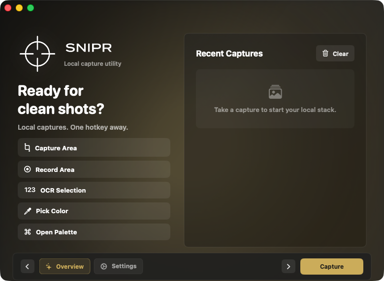

<p align="center">
  
</p>

<h1 align="center">Snipr</h1>

<p align="center">
  Keyboard-first screen capture for macOS — screenshots, recordings, OCR, and annotation, all local.
  <br>
  <a href="https://cryptic0011.github.io/Snipr/"><strong>Website</strong></a> ·
  <a href="https://github.com/Cryptic0011/Snipr/releases/latest"><strong>Download</strong></a>
</p>

<p align="center">
  <a href="https://github.com/Cryptic0011/Snipr/actions/workflows/ci.yml"></a>
</p>

---

Snipr is the **open-source screenshot tool for macOS** — the full
capture → annotate → OCR → ship loop with no subscription, no account, and
no cloud. Everything runs and stays on your machine, and because it's plain
Swift under MIT, you can read, change, and rebuild the tool you run on your
screen.

<p align="center">
  
</p>

## What it does

| | Default hotkey |
|---|---|
| Area capture with 8× loupe, live coordinates, edge snapping, typed dimensions | `⌘⇧4` |
| Window picker & full-screen capture at native Retina resolution | `⌘⇧5` |
| Scrolling capture — stitches a long page into one tall image | via capture toolbar |
| Screen recording (.mov, system audio, trim before save) | `⌘⇧6` |
| OCR any pixels straight to the clipboard | `⌘⇧O` |
| Color picker with hex/RGB/HSL output | `⌘⇧C` |
| Command palette | `⌘⇧Space` |
| Show the Stack | `⌘⇧S` |

Plus: annotation (arrows, shapes, blur, pixelate, step badges, text, crop,
undo/redo), pinned floating captures, the Stack (captures pile up in a corner
until you drag them out, batch-save, or combine to PDF), filename templates,
smart folders, and simple capture workflows. Every hotkey is rebindable in
Settings.

## Privacy

Everything stays on your Mac. No cloud upload, no account, no telemetry.
Sharing goes through the standard macOS share sheet. Updates come from
[Sparkle](https://sparkle-project.org) checked against a public key, and the
app is signed and notarized.

## Install

Grab the DMG from [the latest release](https://github.com/Cryptic0011/Snipr/releases/latest)
(or the [website](https://cryptic0011.github.io/Snipr/)), drag Snipr to
Applications, and grant Screen Recording permission on first capture.
Requires macOS 14+ (Apple Silicon).

## Automation

Every command is scriptable through the `snipr://` URL scheme — from the
terminal, Apple Shortcuts, Raycast, or anything that can open a URL:

```bash
open "snipr://capture"             # area capture
open "snipr://record"              # record an area
open "snipr://ocr"                 # OCR a selection to the clipboard
open "snipr://scrolling-capture"   # start a scrolling capture
open "snipr://pick-color"
```

Any command palette action works by its id: `capture-area`, `record-area`,
`capture-toolbar`, `ocr-selection`, `show-ocr-history`, `pick-color`,
`scan-qr`, `scrolling-capture`, `toggle-desktop-icons`, `open-history`,
`clear-stack`, `open-settings`, `quit`.

## Build from source

```bash
git clone https://github.com/Cryptic0011/Snipr && cd Snipr
swift build          # or: swift test
./script/build_and_run.sh   # builds the .app bundle and launches it
```

Plain SwiftPM — no Xcode project. `HANDOFF.md` maps the architecture;
`RELEASING.md` covers signing, notarization, and shipping your own fork's
releases (you'll need your own Developer ID and Sparkle keys).

## License

[MIT](LICENSE). Fork it, rename it, ship it.
